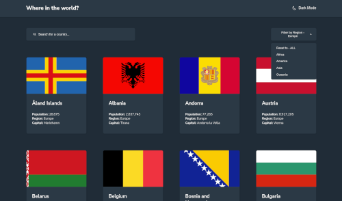

# 🪧 Frontend Mentor - REST Countries API with color theme switcher solution

Status: working on...

## 📋 About

This is a solution to the [REST Countries API with color theme switcher challenge on Frontend Mentor](https://www.frontendmentor.io/challenges/rest-countries-api-with-color-theme-switcher-5cacc469fec04111f7b848ca). Frontend Mentor challenges help you improve your coding skills by building realistic projects.

🌐 **Site published at**: [https://codevivi.github.io/rest-countries-api-with-color-theme-switcher/#/](https://codevivi.github.io/rest-countries-api-with-color-theme-switcher/#/)

**Solution URL**: [at fronendmentor](https://www.frontendmentor.io/solutions/countries-rest-react-app-with-colour-theme-switcher-Nv1pbnC8Rz)

🎯 **Goals:**

Users should be able to:

- [x] See all countries from the [REST Countries API](https://restcountries.com) on the homepage. **API not working anymore, so using local json file for now.**
- [x] Search for a country using an `input` field
- [x] Filter countries by region
- [x] Click on a country to see more detailed information on a separate page
- [x] Click through to the border countries on the detail page
- [x] Toggle the color scheme between light and dark mode _(optional)_

## 🧰 Building with

- React
- SCSS

## 👩‍💻 Author

Vilma Jovaišaitė

- [Github](https://github.com/codevivi)

- Frontend Mentor - [@codevivi](https://www.frontendmentor.io/profile/codevivi)
